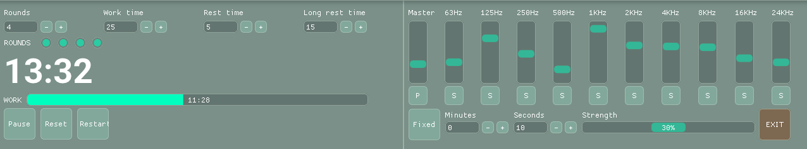

# ZenithTools

ZenithTools aims to be a multi-platform toolset for concentration and productivity enhancement.



## Quick Start

Download the latest binaries for Linux, macOS and Windows from the **Releases** page and run the executable.

## Features

* Customizable pomodoro technique sessions: number of rounds, work and rest time.
* Custom filtered white noise generation to mask environmental noise and keep focused, with animated sliders.

## Future updates

* Add user preferences persistence
* Add Noise presets
* Add an icon to the app
* Update SFML backend so Windows version can be self-contained
* Improve the UI
* Add customizable themed soundscapes
* More productivity tools?

## Known Issues

* Small sound clipping due to hardware not being to reproduce high frequencies, as workarround mute the 24Khz band and so on.

## Releases

* 1.0 is now released! Find binaries for Linux, macOS and Windows on the releases page.

## Documentation

* Project has been documented with Doxygen
  [Online documentation](https://fmontser.github.io/ZenithTools/)
  
* **Or Generate docs:**

  ```bash
  doxygen docs/Doxyfile
  ```

## Dependencies

* [GoogleTest](https://github.com/google/googletest) for unit tests and mocking
* [SFML](https://www.sfml-dev.org/) as GUI backend
* [ImGui](https://github.com/ocornut/imgui) for user interface using the SFML-ImGui library

## Compiling requirements

* A C++17 compliant compiler (e.g., GCC 7+, Clang 5+, MSVC 2017+).

* CMake (version 3.31 or higher).

* **Linux Fedora dependencies:**

```bash
libX11-devel mesa-libGL-devel libgudev-devel openal-soft-devel libvorbis-devel flac-devel libXcursor-devel libXrandr-devel libXi-devel freetype-devel
```

* **Linux Debian dependencies:**

```bash
libx11-dev mesa-common-dev libgl1-mesa-dev libgudev-1.0-dev libopenal-dev libvorbis-dev libflac-dev libxcursor-dev libxrandr-dev libxi-dev libfreetype6-dev
```

* **macOS dependencies:** Xcode

* **Windows dependencies:** Visual Studio with the C++ toolset

## Building

### Clone the repository

```bash
git clone https://github.com/fmontser/ZenithTools.git
cd ZenithTools
git switch stable
```

### Linux/macOS

* **Configure the project with CMake:**

```bash
cmake -S . -B build
```

* **Build the project:**

```bash
cmake --build build
```

### Windows

```bash
# From a Visual Studio Developer Terminal

mkdir build
cd build
cmake .. -G "NMake Makefiles"
nmake
```
